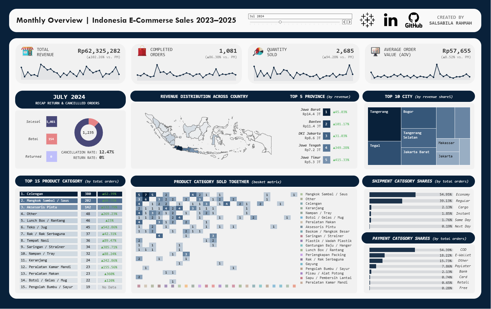
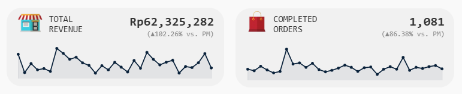
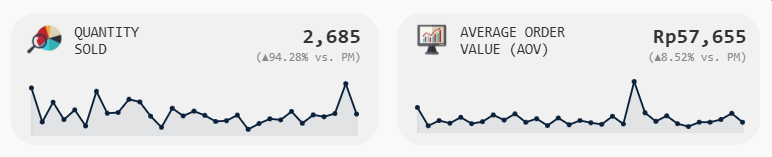
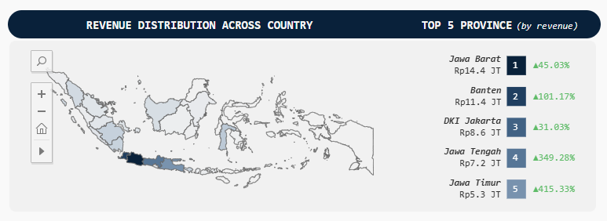
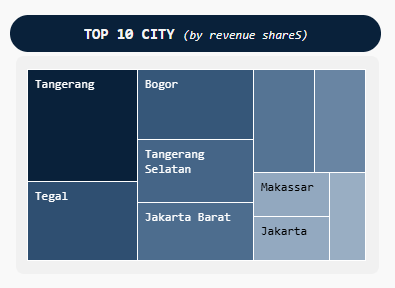
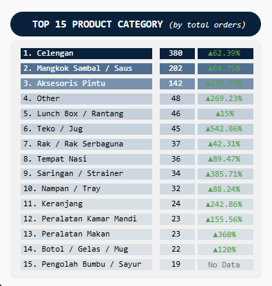
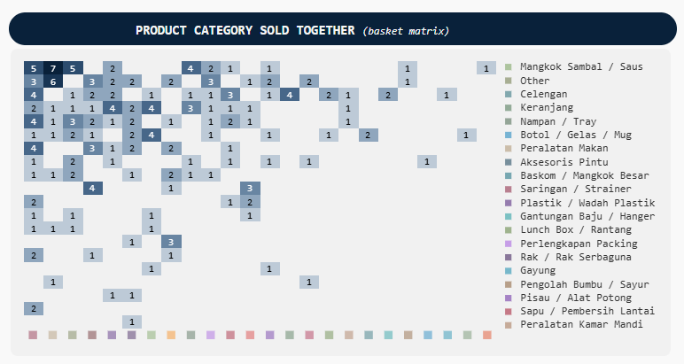
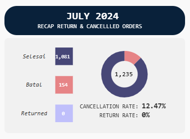
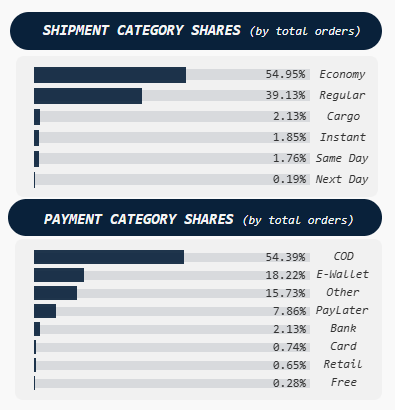

<h1 align="center">Tableau Dashboard Monthly Sales Performance (Indonesia E-Commerce)</h1>

[**Overview**](#overview) → [**Dashboard Preview**](#dashboard-preview) → [**Dashboard Sections**](#dashboard-sections) → [**Implementation Highlights**](#implementation-highlights)

  
Built on the analysis-ready dataset from my previous SQL project, this Tableau dashboard is designed to support monthly performance reporting. It brings together sales performance, geographic distribution, product performance, customer purchasing behavior, shipping, and payment trends in a single interactive dashboard.
  
- **Related SQL Project**: Indonesia E-Commerce Sales Data Preparation with SQL [(view repository)](https://github.com/salsabila-rahmah/Indonesia-E-Commerce-Sales-Data-Preparation-with-SQL)
- **Interactive Dashboard**: Explore the dashboard on Tableau Public [(open dashboard)](https://public.tableau.com/views/MonthlyOverviewIndonesiaE-CommerceSales2023-2025/IndonesiaE-CommerseSales20232025)
- **Tools**: `Tableau Public Desktop`, `SQL (SQLite)`, `dbdiagram.io`, `Google Sheets`

This repository includes both the final dashboard and the development process behind it. The dashboard consists of:

- 20+ worksheets
- 4 dashboard sections
- 1 dynamic parameter
- 20+ calculated fields
- Custom tooltips

How the dashboard was built, including worksheets, layout, and interactions → [📄 Dashboard Development Guide](how%20to%20do/1.%20dashboard%20development%20guide.md)
 
Complete reference for calculated fields, parameters, and formulas → [📄 Calculated Fields & Parameters](how%20to%20do/2.%20calculated%20fields%20%26%20parameters.md)

<h2 align="center">Dashboard Preview</h2>

The dashboard is organized into four sections, each focusing on a different aspect of monthly sales performance.
 [**Executive Summary**](#executive-summary) • [**Geographic Performance**](#geographic-performance) • [**Product Performance**](#product-performance) • [**Operational Overview**](#operational-overview)
 All visualizations update automatically based on the **_selected month_**.

<h2 align="center">Dashboard Sections</h2>

<h3 align="justify">Executive Summary</h3>
The dashboard opens with four KPI cards that provide a quick snapshot of monthly performance. Historical trends and month-over-month comparisons help highlight how the selected month compares with recent performance. 

  
  

<h3 align="justify">Geographic Performance</h3>
Revenue is visualized at both the province and city levels, making it easy to compare performance across different regions of Indonesia. 

  
  

<h3 align="justify">Product Performance</h3>
Alongside product category rankings, this section includes Market Basket Analysis to uncover product categories that customers frequently purchase together. 

  
  

<h3 align="justify">Operational Overview</h3>
Operational metrics complement the sales analysis by highlighting cancellations, returns, shipping preferences, and payment methods. 

  
  

<h2 align="center">Implementation Highlights</h2>

The dashboard combines custom calculations, parameters, and interactive features to support dynamic monthly reporting. Key implementation highlights include: 

- KPI cards with month-over-month comparisons and historical trend sparklines
- Parameter-driven monthly reporting and synchronized dashboard interactions
- Dynamic Top-N rankings that respond to the selected month
- Market Basket Analysis using SQL-generated category pairs
- Interactive maps, treemaps, and custom tooltips for data exploration
